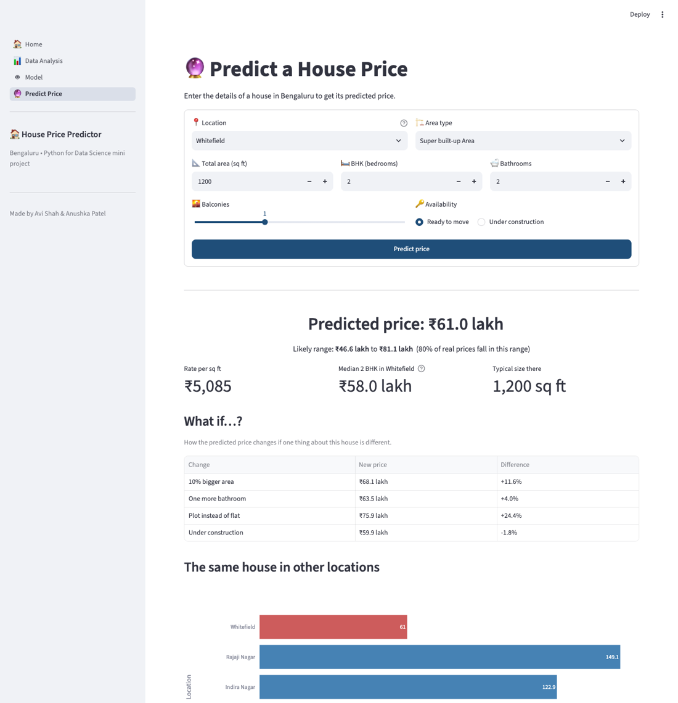
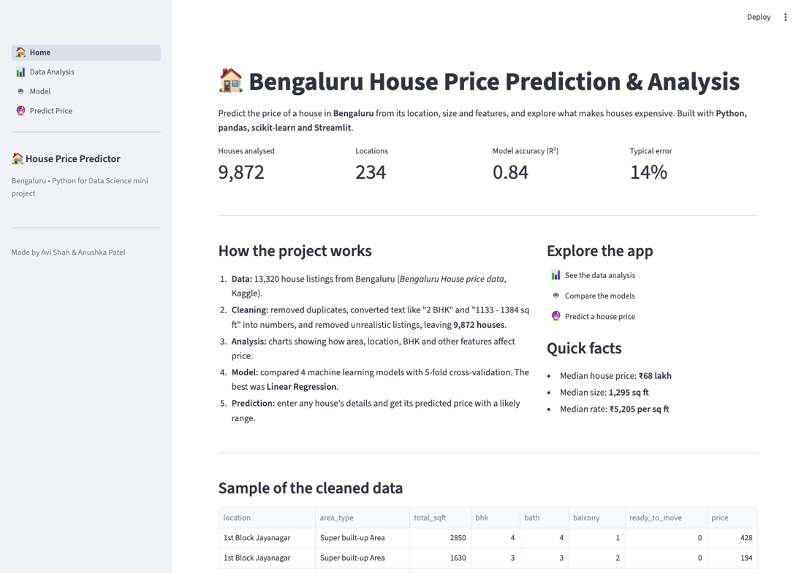
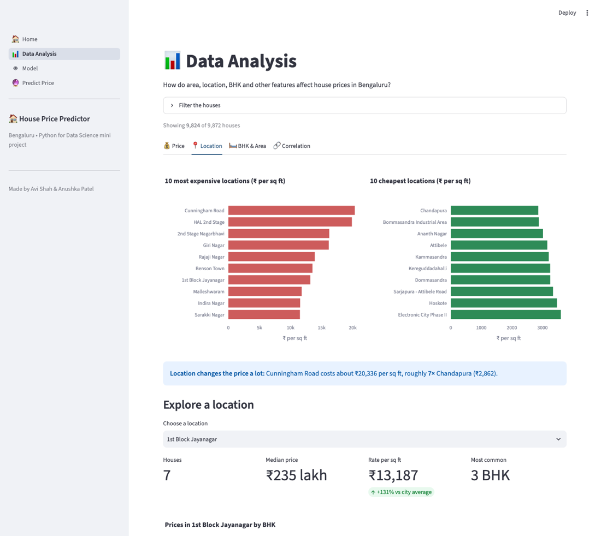
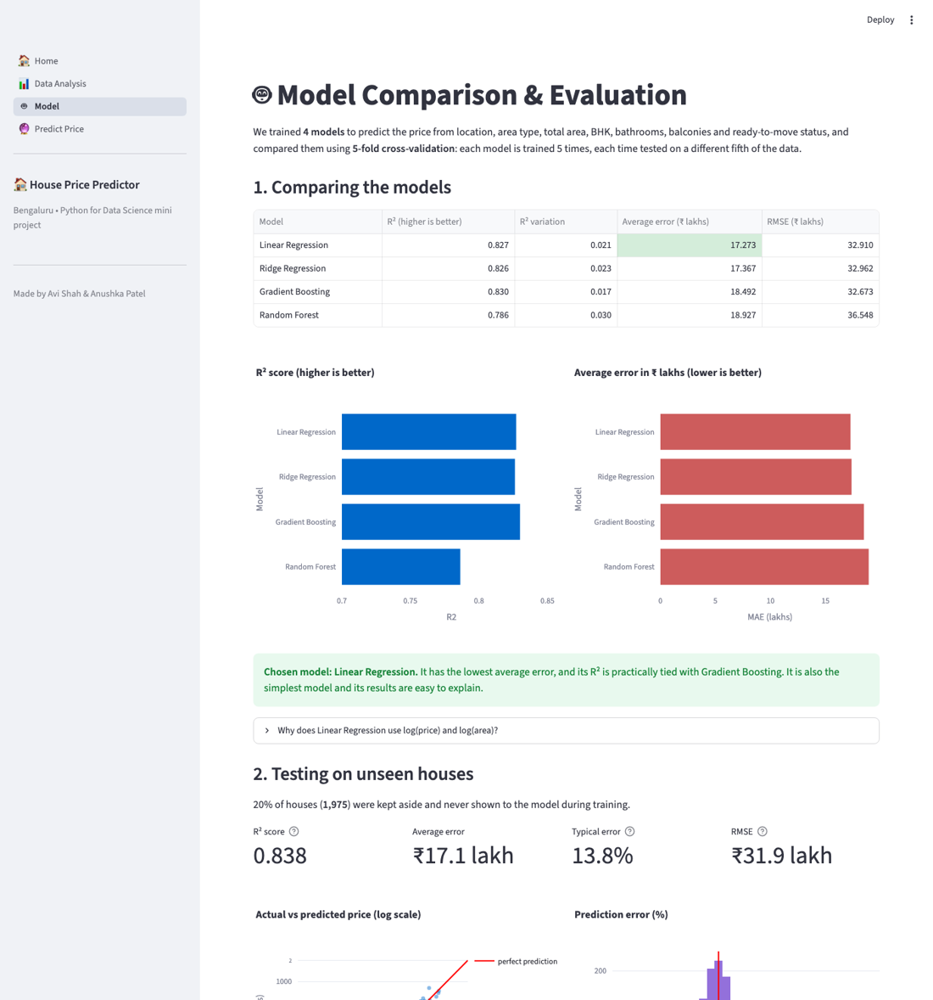

# 🏠 House Price Prediction & Analysis: Bengaluru

Predict the price of a house in **Bengaluru** from its location, size and features, and explore which factors drive house prices.
The project includes a full analysis notebook and an interactive **Streamlit** web app.



## Features

- **Data cleaning:** turns messy real-world listings into clean numbers (e.g. "2 BHK" → 2, "1133 - 1384" sq ft → 1258.5, "34.46Sq. Meter" → 370.9 sq ft) and removes unrealistic listings
- **Exploratory analysis:** price distribution, area vs price, location prices, BHK and area-type effects, correlations
- **Model comparison:** Linear Regression, Ridge, Random Forest and Gradient Boosting, compared with 5-fold cross-validation
- **Price prediction:** enter a house's details to get a predicted price with a likely range, "what if" changes and a comparison across locations

## Dataset

[Bengaluru House price data](https://www.kaggle.com/datasets/amitabhajoy/bengaluru-house-price-data) (Kaggle, Amitabh Ajoy): 13,320 listings with `area_type`, `availability`, `location`, `size`, `society`, `total_sqft`, `bath`, `balcony` and `price` (in ₹ lakhs).

After cleaning: **9,872 houses** in **234 locations** (locations with 10 or fewer houses are grouped as "Other").

## Results

| Model | R² (5-fold CV) | Average error (₹ lakhs) |
|---|---|---|
| **Linear Regression** (log price, log area) | **0.827** | **17.3** |
| Ridge Regression | 0.826 | 17.4 |
| Gradient Boosting | 0.830 | 18.5 |
| Random Forest | 0.786 | 18.9 |

**Chosen model: Linear Regression.** It has the lowest average error, its R² is practically tied with Gradient Boosting, and it is the simplest and most explainable model.

On a held-out test set of 1,975 houses: **R² = 0.838**, average error ₹17.1 lakhs, **typical (median) error 13.8%**.
For 80% of test houses, the real price was within **0.76×–1.33×** of the prediction.

### Key insights

- **Location** is the biggest factor: the most expensive areas cost about **3×** an average location, and the cheapest about 45% less.
- **10% more area** → about **11.6% higher price**.
- **Plots** cost about **24% more** than super built-up flats of the same size.
- Once area is fixed, extra BHK slightly *lowers* price (smaller rooms). Balcony and ready-to-move status hardly matter.

## Screenshots

| Home | Data analysis | Model |
|---|---|---|
|  |  |  |

## How to run

```bash
# 1. create an environment and install the libraries
python3 -m venv .venv
source .venv/bin/activate          # Windows: .venv\Scripts\activate
pip install -r requirements.txt

# 2. (optional) retrain: compares all 4 models and saves the best
python train.py

# 3. start the web app (opens http://localhost:8501)
streamlit run app.py
```

The full analysis is in `notebooks/house_price_analysis.ipynb`. Open it in Jupyter or VS Code.

## Project structure

```
house-price-prediction/
├── app.py                         # Streamlit app: page navigation
├── views/                         # the 4 app pages
│   ├── home.py
│   ├── analysis.py
│   ├── model.py
│   └── predict.py
├── src/
│   ├── data_prep.py               # data cleaning steps
│   ├── model.py                   # models, comparison, prediction
│   └── app_data.py                # cached loading for the app
├── train.py                       # trains, compares and saves the best model
├── models/                        # saved model, metrics, test predictions
├── notebooks/
│   └── house_price_analysis.ipynb # full analysis with explanations
├── data/
│   └── Bengaluru_House_Data.csv   # raw dataset
├── docs/screenshots/
└── requirements.txt
```

## Technologies

Python · pandas · NumPy · scikit-learn · Matplotlib · Seaborn · Plotly · Streamlit · Jupyter

## Authors

Avi Shah & Anushka Patel. Mini project for *Python for Data Science* (202045603).
